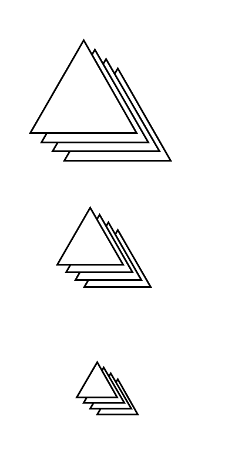

# README

Random triangles (WIP)

2020-05-30

<p align="center">
  
</p>

## Steps

It's important to match the frame rate in the pde script
with the delay in the gif. Delay is a bit weird but
ends up like this: `(FPS) = 100/(delay in ticks)`.
The delay unit are ticks. 1s = 100ticks.

Here the fps is 100, the delay is 1.

```bash
# run processing
# (the idea is to compile an app and then run it, no idea how to though.)

# transform to a gif
convert -delay 1 -loop 0 render/*.png render/out.gif
```
